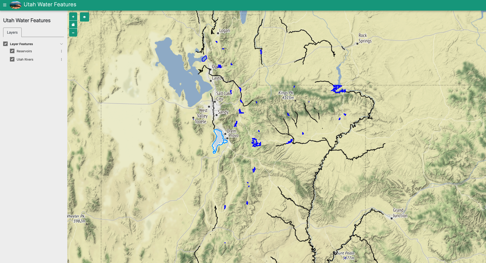

# Utah-Water-Features
Welcome to my Tethys App!
This is a tethys application developed by Jacob Johnson
It implements a map with a WMS and GeoJSON layer. The WMS layer highlights rivers and streams throughout Utah. The GeoJSON

layer highlights reservoirs throughout Utah. Users can select each reservoir and see info on it, along with a time series of the reservoir's

water levels over the past year. This project is inspired by Jacob's love of visiting and exploring the reservoirs of Utah with his wife, Teresa.

Contact Info
Email: jmjohnson1578@gmail.com
Phone Number: 541-226-8349
Linkedin:
Github
